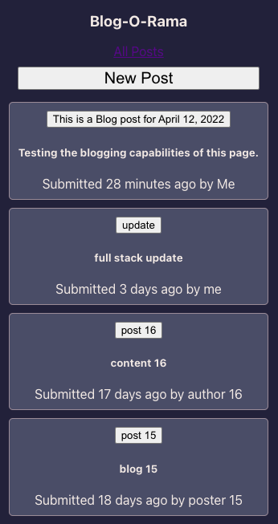
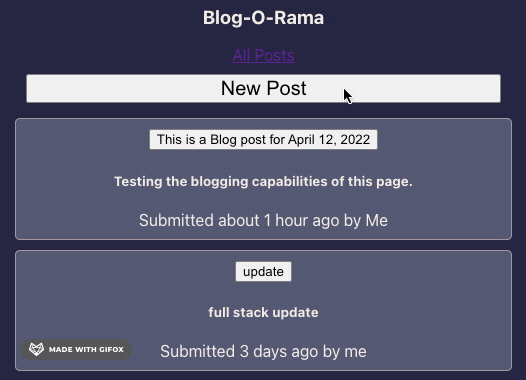
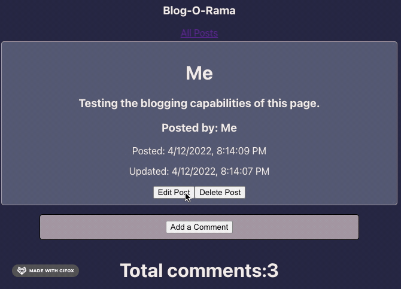
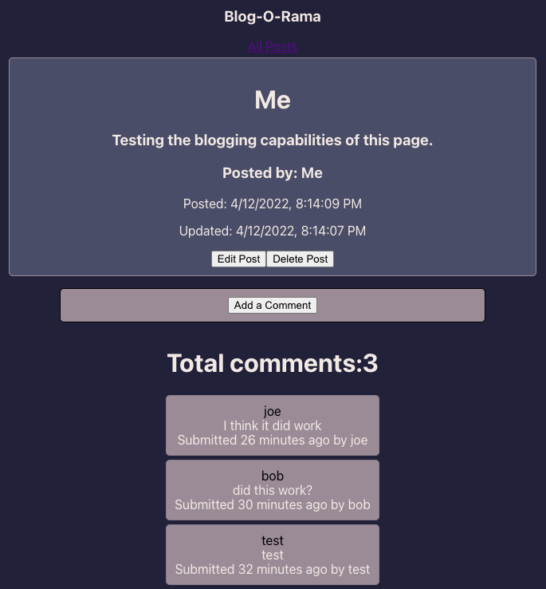

<!--
Hey, thanks for using the awesome-readme-template template.
If you have any enhancements, then fork this project and create a pull request
or just open an issue with the label "enhancement".

Don't forget to give this project a star for additional support ;)
Maybe you can mention me or this repo in the acknowledgements too
-->

<!--
This README is a slimmed down version of the original one.
Removed sections:
- Screenshots
- Running Test
- Deployment
- FAQ
- Acknowledgements
-->

<div align="center">

  <h1>React-O-Blog</h1>
  
  <p>
    A rudementary blog project build with React, express & node. Deployed via AWS EC2 instance.
  </p>
   
<h4>
    <a href="http://18.217.29.20/">View Demo</a>
  </h4>
</div>

<br />

<!-- About the Project -->

## About the Project

<div align="center"> 
  
</div>
<div align="center"> 
  
</div>
<div align="center"> 
  
</div>
<div align="center"> 
  
</div>

<!-- TechStack -->

### Tech Stack

<details>
  <summary>Client</summary>
  <ul>
    <li><a href="https://reactjs.org/">React.js</a></li>
    <li><a href="https://getbootstrap.com/docs/5.1/getting-started/introduction/">Bootstrap 5</a></li>
    <li><a href="https://momentjs.com/">Moment JS</a></li>
  </ul>
</details>

<details>
  <summary>Server</summary>
  <ul>
    <li><a href="https://expressjs.com/">Express.js</a></li>
    <li><a href="https://expressjs.com/">Node.js</a></li>
  </ul>
</details>

<details>
<summary>Database</summary>
  <ul>
    <li><a href="https://www.postgresql.org/">PostgreSQL</a></li>
  </ul>
</details>

<details>
<summary>DevOps</summary>
  <ul>
    <li><a href="https://aws.amazon.com/ec2/">AWS EC2</a></li>
  </ul>
</details>

<!-- Features -->

### Features

- CRUD blog posts
- Comment on blog posts
- Basic API for users, posts, and comments

<!-- Getting Started -->

## Getting Started

<!-- Prerequisites -->
<!-- Installation -->

### Installation

Install my-project with npm

```bash
  npm install
```

<!-- Run Locally -->

### Run Locally

Clone the project

```bash
  git clone https://github.com/mkuek/react-blog.git
```

Go to the project directory

```bash
  cd react-blog
```

Install dependencies

```bash
  npm install
```

Start the server

```bash
  cd server/ && node index.js
```

Start the frontend

```bash
  cd client/ && npm start
```

<!-- Usage -->

## Usage

<!-- Roadmap -->

## Roadmap

- [ ] Add additional styling
- [ ] Less prop drilling
